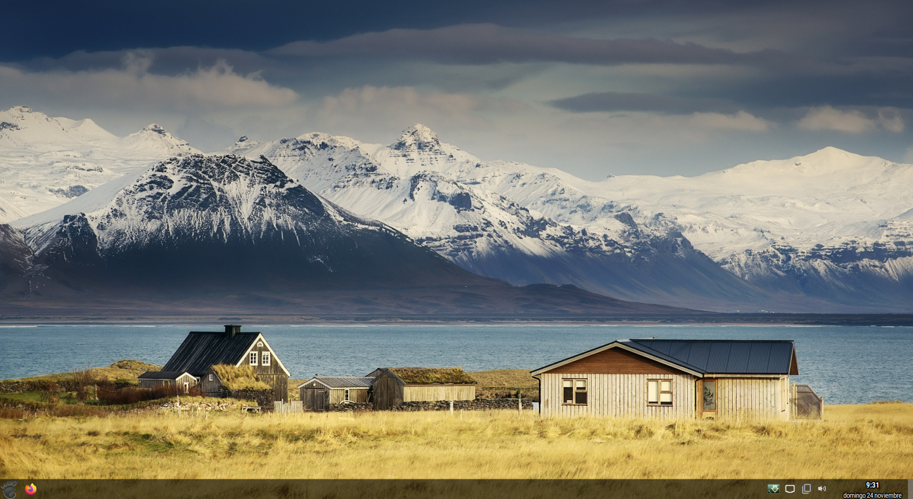

# arch-myinstall

This script, in the meanwhile, contain almost all the packages of my current installation:

+ Base: linux-zen kernel, vim, networkmanager
+ Desktop: Openbox, tint2, jgmenu, compton, gmrun, guake, nm-applet, arc theme, elementary icons, volumeicon, parcellite
+ Wallpaper: gnome-backgrounds, nitrogen
+ Pantheon apps (music, videos, photos, screenshot, code, files)
+ Firefox, Geary, qbittorrent
+ VLC 
+ Preconfigured shortcut keys
  + Win+e Pantheon Files
  + Win+z Firefox
  + Win jgmenu
  + F12 Guake
 
 
